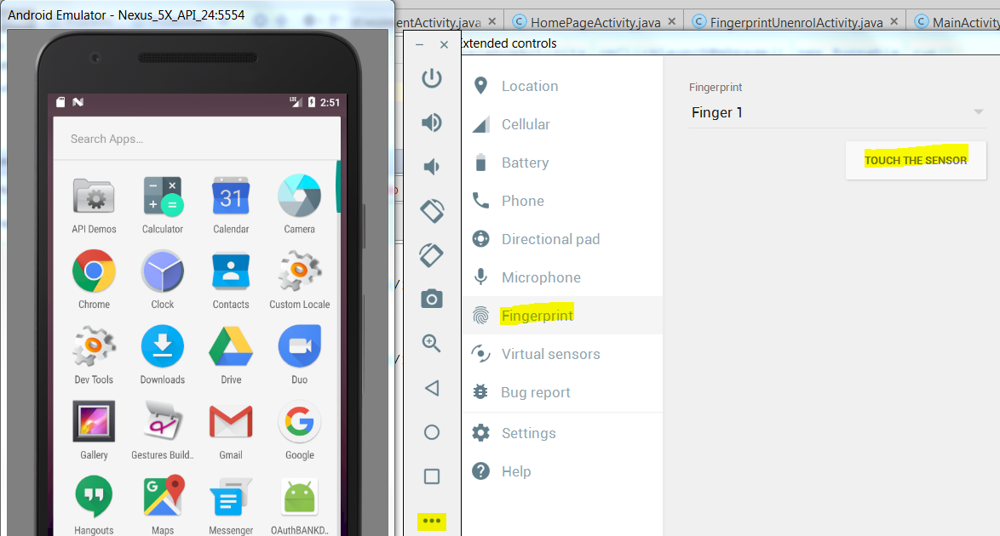

# Register fingerprint on emulator

1. To setup a screen lock, perform the following steps:

2. Go to Settings > Security, and select Screen lock

3. The next screen that appears will allow you select and configure one of the screen lock security methods

4. Select and complete one of the available screen lock methods (Example: Selct and confirm a Pattern)

5. Once the screenlock is configured, return to the Settings > Security page and select Fingerprint

6. From there, follow the sequence to add a fingerprint to the device

7. In the final screen you are prompted to place your finger on the fingerprint scanner:  
     * Option1: Via command line enter this cmmand to register a fingerprint id1:  
       $ adb -e emu finger touch 1
     * Option2: Via emulator UI settings->Click on Fingerprint sensor to register fingerprint    
     