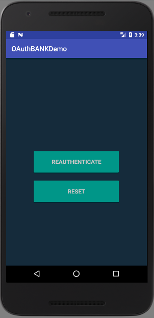
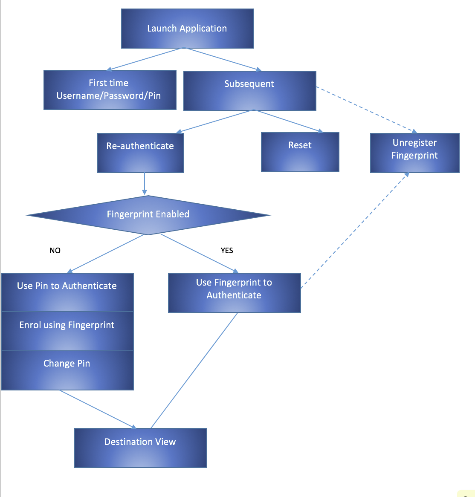

# mobile-sdk-fingerprint-sample
Sample android app using IBM access mobile sdk to showcase oauth capability with additional authentication mechanisms.

## Features in this android app:

- Username password authentication
- Pin authentication
- Fingerprint authentication
- Web View(Pending)
	

## ISAM Pre-Requisites:
 
-  ISAM Appliance Installed 
-  Runtime and Reverse proxy configured
-  Create a test user on ISAM
-  Set up authentication mechanism for username/password
-  AAC configured against reverse proxy
-  ROPC API protection policy and API Protection client 
-  Session end point enabled 
-  Create a dummy resource.html under reverseproxy management root and apply API protection policy
-  Create a dummy webpage.html under reverseproxy management root
-  Update Mapping rules with these files: [PreMapping Rule](Extra/pre_mapping_rule.js) and [PostMapping Rule](Extra/post_mapping_rule.js)
	

## Android Pre-Requisites:

- Open android app gradle project in Android studio 
- Update IBM Mobile Android SDK dependency jars [Instructions to set up sdk dependency](Extra/getting-the-sdk.md) 
- Enable fingerprint on android emulator [Instructions to set up fingerprint on emulator](Extra/register_fingerprint.md)
- Deploy android application


## Demo Screens: 

 1. Settings Screen: 
	- Reverse Proxy IP address and API protection client
	
*

 2. ROPC Screen : 
	- Input Username , Password and Pin 
	- Result: Refresh and Access token
	
*

 3. Subsequent Logins: 
	- Reauthenticate : Pin authenticate or fingerprint authenticate to request access tokens
	- 
	- Reset: Initiate Log out and reset application to do ROPC screen
	- 
         
	- Reauthenticate:
	- 3a: Pin Authenticate : Input Pin Output Refresh and Access token
	- 3b: Touch ID enrol: Input Pin & fingerprint validate to unlock keystore Output Refresh and Accestoken
	- 3c: Change Pin : Input Old Pin and New Pin Output Refresh and Access token
	
        - 
	
	- 3d: fingerprint authentication: Input fingerprint to unlock keystore Output Refresh and Access token
	
	- 
	
	- Unregister fingerprint: If fingerprint is registered to fall back to passcode and unenrol fingerprint click  Unregister fingerprint
	- 
	


 4. Destination Resource View: 
        - Destination Resource request 
	- 
	
	- Show Balance: Native app pop up dialog
	- 
	
	- WebLaunch: Launches webview within app by exchanging access token for an authenticated web session
	- 


## Workflow: 




## Links:

### Mobile SDK : [Download Link](https://ibm.biz/ibmsecuritymobileaccesssdk)

# Pending issues:
- 1. Verify signature in mapping rule is turned off i.e. returns true for all validations, that has to be changed to verify signature (Probable error in base64 encode options sending signatures on the wire)

- 2. WebView getting PD-S session from webseal but even after passing PD-S webpage.html gets a 403


# License

The contents of this repository are open-source under [this license](LICENSE). The SDK itself is closed-source.

```
Copyright 2017 International Business Machines

Licensed under the Apache License, Version 2.0 (the "License");
you may not use this file except in compliance with the License.
You may obtain a copy of the License at

    http://www.apache.org/licenses/LICENSE-2.0

Unless required by applicable law or agreed to in writing, software
distributed under the License is distributed on an "AS IS" BASIS,
WITHOUT WARRANTIES OR CONDITIONS OF ANY KIND, either express or implied.
See the License for the specific language governing permissions and
limitations under the License.
```

