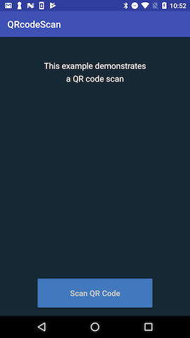
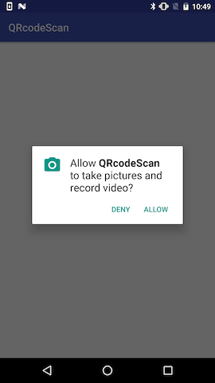
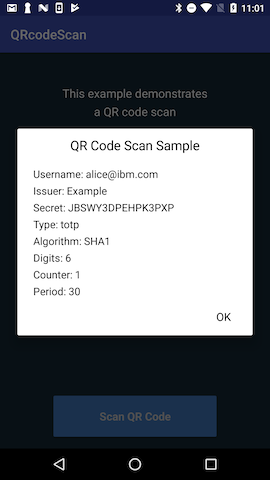

# QR code scanning

This example demonstrates scanning a QR code for one-time password (OTP) generation or multi-factor authentication (MMFA) with ISAM.

### Screenshots





## Scanning and processing QR codes

The SDK provides `OtpQRScanResult` and `MfaQRScanResult` classes.

| Type | Purpose | Example |
| ---- | ------- | ------- |
| OtpQRScanResult | A standard one-time password | `otpauth://hotp/Big%20Blue%20Bank:testuser?secret=JBSWY3DPEHPK3PXP` |
| MfaQRScanResult | An ISAM multi-factor-auth account | `{"code": "OAuthAuthorizationCode", "details_url": "https://big-blue-bank.com/registration_details", "client_id": "OAuthClientId", "token_endpoint": "https://big-blue-bank.com/oauth/oauth20/authorize", "version": 1}` |

To scan a QR code, you could use the `UIQRScanView` class, which produces these result objects. If you want to use your own scanner, there are `.parse()` methods to generate the results.

Launch the `UIQRScanView` activity with `startActivityForResult(...)`. It will return with an `IQRScanResult` in the result `Intent` (keyed as `IQRScanResult.class.getName()`) or `null` if the user cancels it.

You need to include the activity in your app manifest:

```xml
<application>
    <!-- your other configuration items -->
    <activity android:name="com.ibm.security.access.mobile.authentication.UIQRScanView" />
</application>
```
