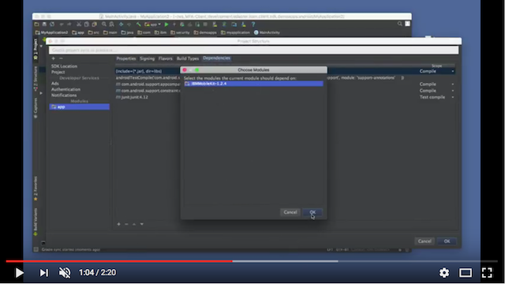

# Configuring your environment

## Android Studio setup

[](https://youtube.com/watch?v=6b2NGNn5yeg)

1\. After downloading the SDK, extract the contents to a folder that is easily located.

2\. Start Android Studio and create a new project by accepting the default settings.

3\. Go to `File` -> `Project Structure...` and add a new module by click on the `+` symbol in the upper left corner.

4\. Select `Import .JAR/.AAR package` and click `Next`.

5\. Click on the Browse button for the `File name` and select the `IBMMobileKit-<version>.aar` on
your file system. Click `Finish`.

6\. In the left side bar, select your app and then in the tab view, go to the `Dependencies` tab.

7\. Add a new dependency by clicking on the `+` symbol at the bottom. Select `Module dependency`.

8\. Select the `IBMMobileKit-<version>` module in the dialog.

9\. Close the dialogs.

10\. Click on the `Sync your project with Gradle files` icon.


**You should now have the SDK properly linked! Let's test it.**

11\. In your `MainActivity.java`, inside `onCreate()`, add these lines:
```java
HotpGeneratorContext context = new HotpGeneratorContext("abcd", 1);
Log.i(this.getClass().getSimpleName(), "HOTP: " + context.create());
```

12\. At the top of the file, import these package members:
```java
import android.util.Log;
import com.ibm.security.access.mobile.authorization.HotpGeneratorContext;
```

13\. Launch the app in an emulator. Look in Android Monitor, ensuring that your log level is set to "Info":

You'll see a line like this:

    12-19 21:46:49.718 6143-6143/com.ibm.security.sdkimportdemo I/MainActivity: HOTP: 300079

Done.
