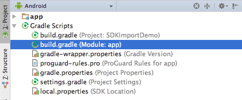

# Configuring your environment

## Download
To access the SDK you need to sign in with an IBM ID account.

Create your free [IBM ID](https://www.ibm.com/account/us-en/signup/register.html) and navigate to [Fix Central](https://ibm.biz/ibmsecuritymobileaccesssdk) to download the SDK.

## Android Studio setup

Please note: if you download any of the sample apps, the workspace is configured for the SDK. Just drop the library file into `app/libs`.

[](https://youtube.com/watch?v=D9kd4idYzk0)

1\. [Download the .zip](README.md#Download) and extract to somewhere easily located. The SDK file to import is the `.aar`.
 
2\. Start Android Studio and create a new project.

3\. In the Android sidebar, right-click the "app" module, and then "Reveal in Finder" (macOS) or "Show in Explorer" (Windows).

4\. Create a `libs` directory inside `app`. Copy `IBMMobileKit-1.2.1.aar` from the .zip into `libs`.

5\. In the Android sidebar, expand the "Gradle Scripts" group, and open the "build.gradle" file relating to your module (usually "app").



6\. Add the following lines to your `android` block:
```gradle
repositories {
    flatDir {
	    dirs 'libs'
    }
}
```

This tells Gradle: when building the "app" module, search the "libs" directory for dependencies (such as the Mobile Access SDK).

7\. Add the following line to your dependencies block:
```gradle
dependencies {
    compile 'com.ibm.security.access.mobile:IBMMobileKit-1.2.1@aar'
}
```
This tells Gradle: when compiling the "app" module, search for and include the dependency `com.ibm.security.access.mobile` in `IBMMobileKit-1.2.1.aar`.

You should now have the SDK properly linked! Let's test it.

8\. In your `MainActivity.java`, inside `onCreate()`, add these lines:
```java
HotpGeneratorContext context = new HotpGeneratorContext("abcd", 1);
Log.i(this.getClass().getSimpleName(), "Hello, world! First hashed one-time password: " + context.create());
```

9\. At the top of the file, import these package members:
```java
import android.util.Log;
import com.ibm.security.access.mobile.authorization.HotpGeneratorContext;
```

10\. Launch the app in an emulator. Look in Android Monitor, ensuring that your log level is set to "Info":


You'll see a line like this:

    12-19 21:46:49.718 6143-6143/com.ibm.security.sdkimportdemo I/MainActivity: Hello, world! First hashed one-time password: 300079

Done.
